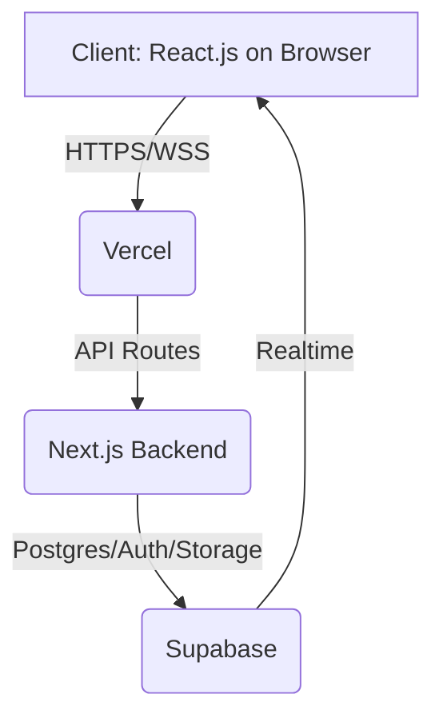
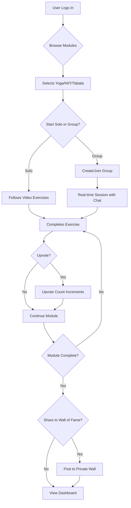
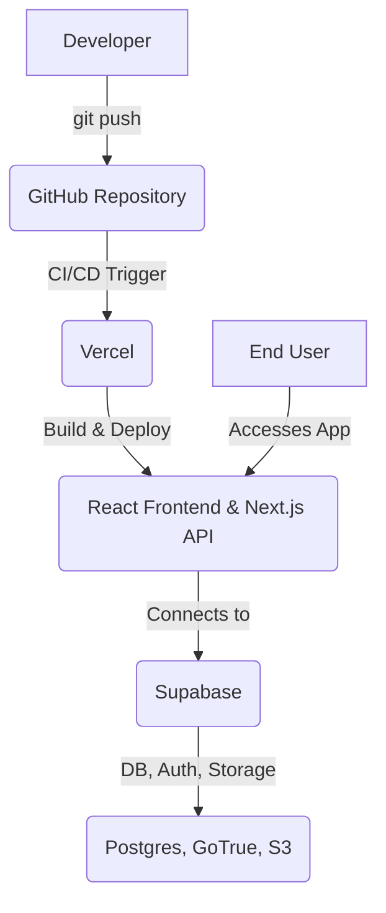

# Fitness/Health SaaS App - Coding Agent Instructions

## 1. Tech Stack

-   **Frontend:** React.js
-   **Backend:** Next.js (API routes, SSR)
-   **Auth & Database:** Supabase (Postgres, Realtime, Auth, Storage)
-   **Deployment:** Vercel

## 2. Diagrams

### High-Level Architecture



### User Workout Flow



### Deployment Diagram



## 3. Project Overview

A web-based application for fitness enthusiasts that lets users join or create workout modules (e.g., yoga, HIIT, tabata), exercise with others in real time, chat during sessions, upvote content, and showcase achievements—all tracked in a personal dashboard. Admins curate modules and analyze user engagement.

## 4. User Stories

-   As a user, I want to browse different workout modules (Yoga, HIIT, Tabata).
-   As a user, I want to start a workout module and follow along with the video exercises.
-   As a user, I want to create or join a group (up to 10 users) for a real-time collaborative workout.
-   As a user, I want to chat with my group while doing exercises (chat history ephemeral, deleted after session).
-   As a user, I want to upvote exercises I like.
-   As a user, I want to share completed exercises or modules on a private wall of fame, motivating myself and others.
-   As a user, I want to see my workout activity in graphs and streak counters on my dashboard.
-   As a user, I want to join public groups or private groups via invite link or user search.
-   As a user, I want privacy; only users can view my wall of fame posts.

## 5. Functional Requirements

### Authentication

-   Sign up/login/social login via Supabase Auth
-   Forgot password, email verification

### Workout Modules

-   CRUD for workout modules and exercises
-   Embedded video exercises
-   Sequenced flow UI for module completion
-   Pre-loaded mock data for modules & exercises

### Group Workouts

-   Groups support up to 10 users
-   Users can join public groups or private groups (invite link/search)
-   Real-time presence via Supabase
-   Ephemeral group chat during session (deleted post-workout)

### Upvotes & Walls

-   Upvote exercises
-   Share completed exercises/modules to a personal wall of fame
-   Privacy: only users can see posts on walls (no public/non-user access)

### Progress Dashboard

-   Graphs and streaks visualizations
-   Completed modules/exercises tracking

## 6. Non-Functional Requirements

-   High availability & scalability (Vercel auto-scaling)
-   Secure user data (Supabase ACL)
-   Fast video streaming (Supabase storage/CDN)
-   Sporty, energetic responsive UI (mobile/desktop)
-   Low latency for chat, group, upvote
-   Accessibility (WCAG compliance)
-   GDPR/privacy-compliant
-   Error/logging monitoring (Vercel analytics/Sentry)

## 7. Gherkin Stories

```gherkin
Feature: Workout Module Selection
  Scenario: User starts HIIT module
    Given the user is authenticated
    When the user selects the HIIT module
    Then the video series begins, and progress is tracked

Feature: Group Workout & Ephemeral Chat
  Scenario: Group session with chat
    Given the user creates a group (max 10) and invites friends or joins public group
    And users join the group session
    Then all can see each other, exercise together, and use chat during the workout
    And chat is deleted after session ends

Feature: Upvoting Exercise
  Scenario: Upvote action
    Given the user completes an exercise video
    When the user clicks "Upvote"
    Then count increases

Feature: Sharing to Wall of Fame
  Scenario: Private sharing
    Given the user completes a module
    When the user shares completion
    Then it is posted to their private wall, visible only to app users

Feature: Dashboard View
  Scenario: Progress review
    Given the user has completed exercises or modules
    When the user views dashboard
    Then graphs and streaks are shown

Feature: Join Group
  Scenario: User joins workout group
    Given the user is authenticated
    When the user joins a public group or accepts invite
    Then they participate in the session
```

## 8. Admin Section

### Login

-   Access via admin login page
-   **Username:** `admin`
-   **Password:** `admin6643` (demo only; use secure method for production)

### Admin Functionalities

-   Create/edit/delete modules & exercises
-   Add follow-along videos to exercises
-   Curate, reorder, publish/unpublish modules/exercises
-   View stats: total users, login history, modules signed up for, exercises completed, upvotes per module/exercise
-   Bulk delete (modules, exercises, user accounts)
-   Wall moderation: remove improper content or spam (on walls)

### Security

-   Separate admin endpoints/routes
-   Middleware for admin authentication
-   Log all admin actions

## 9. Deployment Guide (Summary)

-   Connect GitHub repo to Vercel for CI/CD
-   Configure `.env` with Supabase credentials (URL, anon/public keys)
-   Create Supabase schema: `users`, `modules`, `exercises`, `groups`, `upvotes`, `walls`
-   Enable Supabase realtime and storage (for video streaming)
-   Set up initial mock data
-   Enable Vercel analytics, domains, SSL
-   Monitor deployments with Vercel dashboard

## 10. Troubleshooting & Testing Guide

### API Testing

-   Use Postman/Insomnia to verify Next.js/Supabase endpoints
-   Test all CRUD, group creation/join, chat, upvotes, sharing, admin functions
-   Check error handling for invalid auth/data

### Unit Testing

-   Jest + React Testing Library: components, hooks, utilities
-   Mock Supabase API calls

### Integration Testing

-   Cypress for user workflows: login, module selection, group session, chat, upvote, share, dashboard, admin actions
-   Validate real-time features: multiple sessions browser

### Common Issues

-   **Supabase Auth/config errors:** check credentials, roles
-   **Video not streaming:** confirm storage/CDN setup
-   **Lost chat:** check Supabase realtime config
-   **Graph errors:** validate Supabase migrations/schema

## 11. Initial Mock Data

Pre-load the following for dev/testing:

-   **Modules:** Yoga, HIIT, Tabata
-   **Exercises:** 3-5 per module, each with video (use placeholder links)
-   **Demo users:** 5 (names, emails, avatars)
-   **Group samples:** 2 active test groups
-   **Upvotes:** random upvote distribution
-   **Wall of fame:** sample completion posts per demo user

## 12. Notes

-   Group size limit: 10 members
-   Both public and private group joins supported
-   Ephemeral chat (deleted after workout session)
-   UI: sporty, energetic color palette and design
-   No support for images/GIFs, only videos
-   Wall of fame visible only to logged-in users
-   Admin password is for demo/testing only
